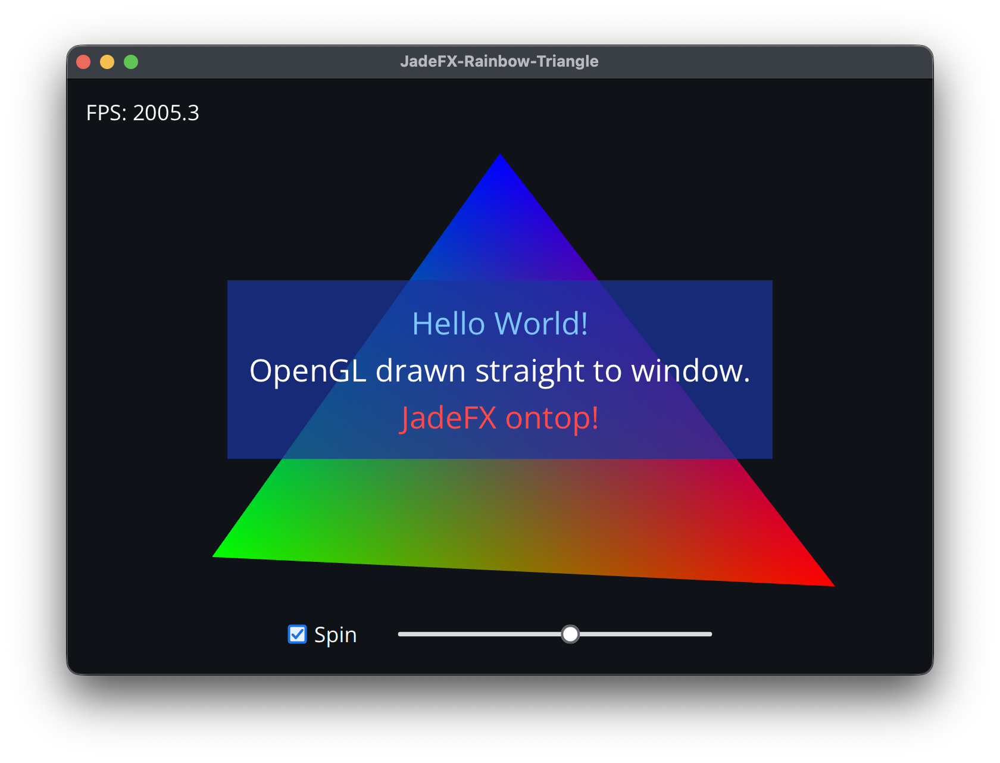

# JadeFX-Rainbow-Triangle

An OpenGL 4.1 window that draws a rainbow triangle and lays a JadeFX interface on top of it.



## Build

JadeFX lives in a sibling directory, `../JadeFX_CPP`. CMake fetches GLFW 3.5.1 when it is not already installed.

```sh
make
make run
```

`make run` rebuilds, then launches the app. On macOS the result is `build/JadeFX-Rainbow-Triangle.app`. On Windows and Linux it is a normal executable named `JadeFX-Rainbow-Triangle`.

The same build from CMake directly:

```sh
cmake -S . -B build -DCMAKE_BUILD_TYPE=Release
cmake --build build --parallel
```

Point `JADEFX_CPP_DIR` at the JadeFX source if it is not next to this tree. A Linux build of the fetched GLFW also needs the X11 and Wayland development packages.

Shaders are loaded at startup from the app bundle (`Contents/Resources/shaders` on macOS) or from a `shaders/` directory beside the executable. Editing `shaders/triangle.vert` or `shaders/triangle.frag` takes effect on the next launch.
